<h1 align="center">Hey there 👋, I'm Vanessa! Welcome to my page 😃</h1>
<h3 align="center">Systems Developer & MSc Computer Science Researcher | Accra, Ghana 🇬🇭</h3>

  

- 🔭 I'm currently researching **ML-based a priori prediction of neural network training energy consumption**, using the BUTTER-E and EC-NAS datasets, with a focus on cross-architecture transferability — my MSc thesis at the University of Ghana, Legon

- 💼 I work as a **Systems Developer at Attain Enterprise Solutions**, deployed onsite at Ghana's National Pensions Regulatory Authority (NPRA), building on Yii2/PHP with SQL Server

- 🎭 I'm looking to collaborate on **energy-efficient ML / sustainable AI, and image or object detection projects**

- 📚 All of my projects are available at [github.com/VanessaAttaFynn](https://github.com/VanessaAttaFynn)

- 📨 How to reach me **vattafynn.work@gmail.com**

- 🐱‍👤 I enjoy watching anime, reading manga and light novels, and spending time with my kitty cats

- ☄ I love to imagine myself as **an astronaut drifting in space, through an ocean of stars ✨. Just imagining the feeling of weightlessness and the strange possibilities that may exist somewhere in the universe 🎈**

<h3 align="left">Connect with me:</h3>

<h3 align="left">Languages and Tools:</h3>

<!-- <h3 align="left">Statistics:</h3>

 -->

<h3 align="left">Support:</h3>

  
